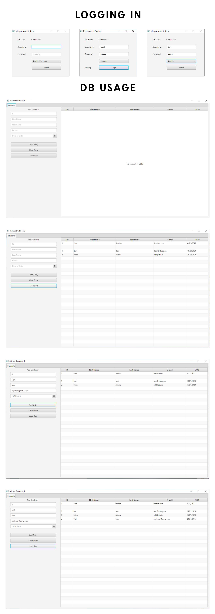

# Management System

School Management System written with Java, uses SQLite database and has graphical user interface.

**Features of the project are:**
- Logging into database
- Loading users from SQLite database
- Adding users to database

